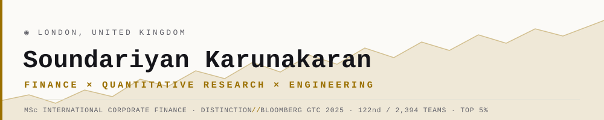
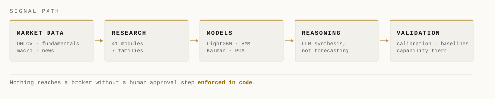

<picture>
  <source media="(prefers-color-scheme: dark)" srcset="assets/header-dark.svg">
  
</picture>

  
  
  

I have a corporate finance background and I write the software myself. Most of my work sits
where those two things meet: research systems that take market data in one end and produce a
decision a human can actually interrogate at the other — with the reasoning, the uncertainty
and the failure modes all visible rather than hidden behind a single number.

I care more about whether a model is *measurably* right than whether it looks sophisticated.
That conviction shapes everything below.

---

## Focus

| | |
|---|---|
| **Primary** | Investment risk · quantitative analysis · markets research |
| **Also** | Valuation & financial modelling · corporate finance · systematic strategy design |
| **Building** | [ARIA](https://github.com/Build-with-SK/Aria) — a self-hosted markets research terminal |
| **Based** | London, United Kingdom |
| **Education** | MSc International Corporate Finance — Distinction |

---

## What I build

<table>
<tr>
<td width="50%" valign="top">

**Quantitative research**

Factor and regime analysis, walk-forward backtesting,
position sizing under uncertainty, and calibration
testing — checking whether a stated confidence of 70%
actually resolves correct 70% of the time.

</td>
<td width="50%" valign="top">

**AI applied to finance**

Retrieval pipelines over financial text, local LLM
inference for synthesis, and evaluation harnesses.
I use language models to *explain* evidence, never
to forecast prices.

</td>
</tr>
<tr>
<td width="50%" valign="top">

**Financial modelling**

Valuation, FX and currency risk, cost of capital,
earnings sensitivity and scenario analysis — the
corporate finance work the MSc was built on.

</td>
<td width="50%" valign="top">

**Data & systems engineering**

Market data pipelines across 21,067 symbols, REST
APIs, schedulers, symbol-identity resolution, and
the test suites that keep any of it trustworthy.

</td>
</tr>
</table>

---

## Featured — ARIA

> **Adaptive Reasoning & Intelligence Architecture** · [`Build-with-SK/Aria`](https://github.com/Build-with-SK/Aria) · Python · FastAPI · React · MIT

A self-hosted research terminal for markets. Data across 21,067 symbols and 34 exchanges feeds
41 independent research modules; their outputs are combined, scored against naive baselines,
tracked for calibration, and gated behind a human approval step that is enforced in code — not
by convention, and not by a config flag.

<picture>
  <source media="(prefers-color-scheme: dark)" srcset="assets/pipeline-dark.svg">
  
</picture>

**Scale** — every figure below is a count you can reproduce from the repository, not a claim.

| | |
|---|---|
| **66,288** lines of Python | **19,030** lines of tests |
| **73** test modules | **185** HTTP endpoints |
| **41** research modules | **17** strategy engines |
| **21,067** symbols indexed | **34** exchanges |

**Why it is worth your time.** Most trading repositories lead with a backtest curve. This one
leads with a section called *What ARIA does not claim*, and the first thing it tells you is that
there is **no demonstrated edge**: as of 2026-09-06 the prediction ledger read *201 resolved
events, 52.2% correct, 95% CI 45.4%–59.0%* — statistically indistinguishable from chance. That
sentence is generated from the ledger rather than written by hand, so it cannot quietly go
stale, and it appears in the daily report as well as the README.

Building the part that measures honestly was harder than building the part that predicts.
Architecture is not evidence, and a system that says so is the one I would want on a risk desk.

**Selected capabilities** — calibration and Brier scoring against naive baselines · capability
tiers that keep every module `experimental` until its own resolved calls earn promotion ·
quarter-Kelly position sizing with a risk-officer veto · regime detection (HMM, Kalman, PCA) ·
retrieval-augmented reasoning over a local vector store · a kill switch that cannot be released
over HTTP.

> ARIA is a research and education tool. It is not a licensed financial adviser and does not give
> personalised investment advice.

---

## Stack

| | |
|---|---|
| **Languages** | Python · SQL · JavaScript · Bash / PowerShell · HTML / CSS |
| **Data & ML** | pandas · NumPy · scikit-learn · LightGBM · hidden Markov models · Kalman filters · PCA |
| **AI** | Anthropic Claude API · Ollama (local inference) · ChromaDB · sentence-transformers · retrieval pipelines · LLM evaluation |
| **Backend** | FastAPI · APScheduler · SQLite · REST API design · session auth · pytest |
| **Frontend** | React · Vite · Recharts · design systems · accessibility · PWA |
| **Finance** | Valuation & modelling · backtesting and walk-forward validation · risk and position sizing · options & Black–Scholes · FX hedging · macro and regime analysis |

---

## How I think about this

**Calibration beats accuracy.** A model that is right 55% of the time and *knows* it is worth
more than one that is right 60% of the time and claims 90%. Position size is set from the stated
confidence, so whether that confidence is honest is the whole game.

**More parameters, more ways to fit noise.** Forty-one research modules is a lot of degrees of
freedom. That is a risk to be managed with out-of-sample discipline and tiering, not a feature to
advertise.

**An unmeasurable quantity should be reported as unmeasurable** — never as a number with a wide
error bar, because readers round the error bar away and keep the number.

**The human stays in the loop by construction.** If the approval gate can be switched off in a
settings file, it is not a gate. It should take a deliberate code change.

---

## Credentials

| | |
|---|---|
| **MSc International Corporate Finance** | Distinction · United Kingdom |
| **Bloomberg Global Trading Challenge 2025** | Captained *The Sharpe Syndicate* — **122nd of 2,394 teams** worldwide (top 5%), **34th in Europe** |

---

  <a href="https://www.linkedin.com/in/soundariyan-karunakaran-363064205"><b>LinkedIn</b></a>
  &nbsp;·&nbsp;
  <a href="mailto:ksoundariyan000@gmail.com"><b>Email</b></a>
  &nbsp;·&nbsp;
  <a href="https://github.com/Build-with-SK/Aria"><b>ARIA</b></a>

Open to investment risk, quantitative analysis and markets research roles in the UK.

